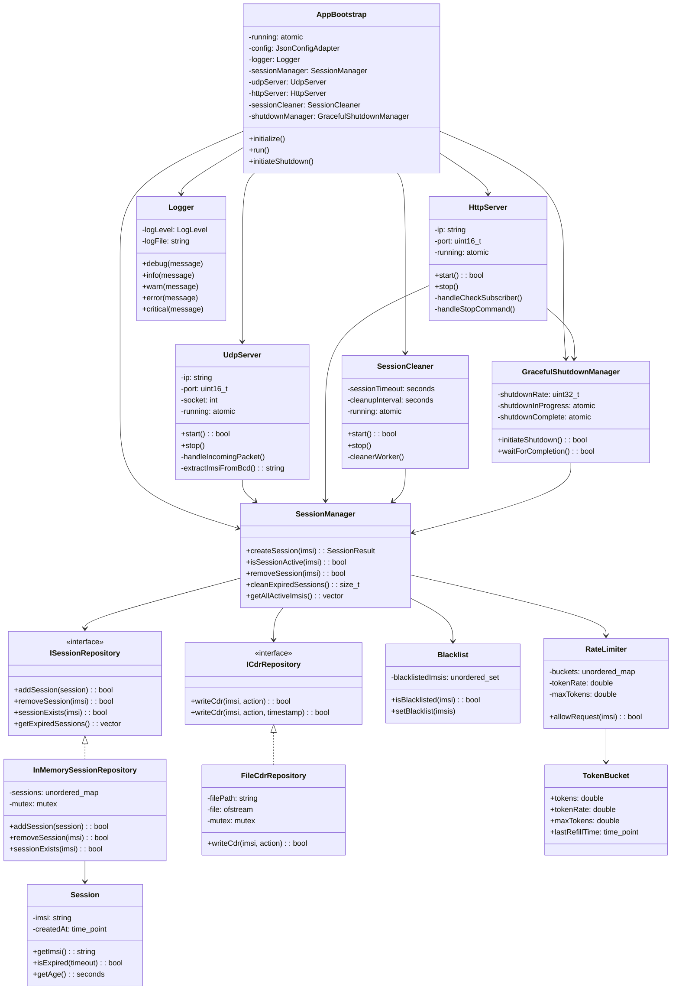
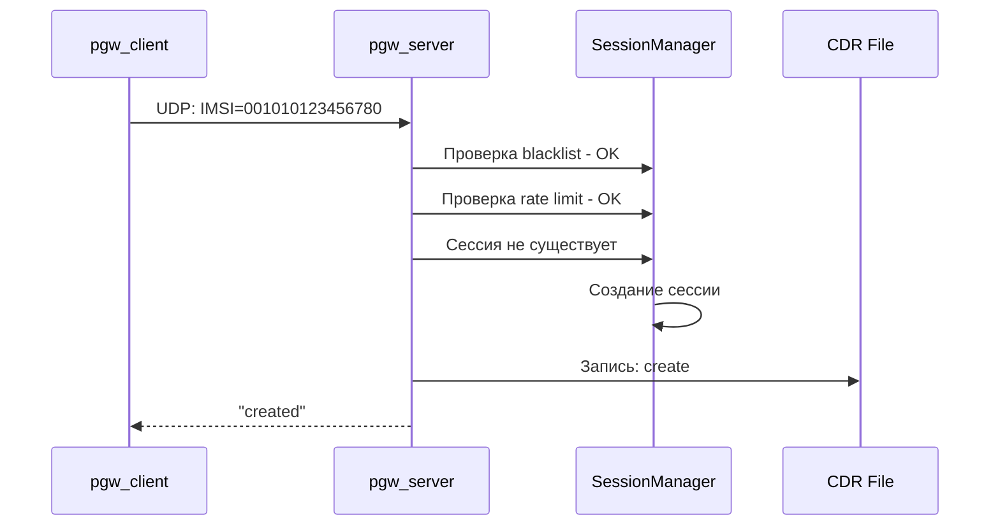
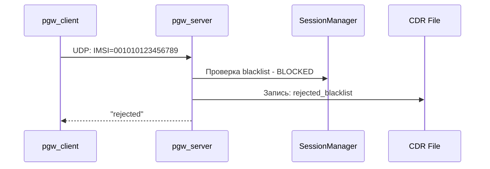
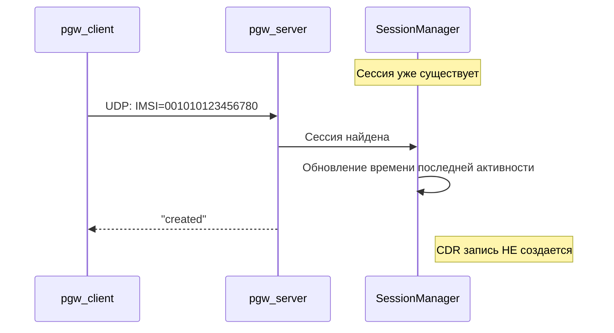
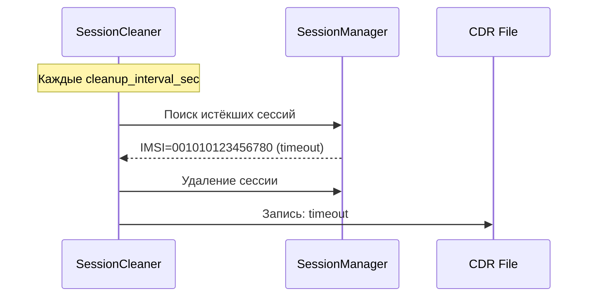

# Mini-PGW

Упрощённая модель сетевого компонента PGW (Packet Gateway) для управления сессиями мобильных абонентов.

## Что делает проект

**pgw_server** — основной сервер, который:
- Принимает UDP-запросы с IMSI абонентов
- Создаёт/отклоняет сессии на основе чёрного списка
- Ведёт CDR-журнал всех операций
- Предоставляет HTTP API для мониторинга
- Автоматически удаляет истёкшие сессии

**pgw_client** — тестовый клиент для отправки запросов на сервер

## Быстрый запуск

### 1. Сборка проекта
```bash
mkdir build && cd build
cmake ..
make
```

### 2. Настройка сервера
Создайте `config/server_config.json`:
```json
{
  "udp_ip": "0.0.0.0",
  "udp_port": 9000,
  "http_port": 8080,
  "session_timeout_sec": 30,
  "cdr_file": "cdr.log",
  "log_file": "pgw.log",
  "log_level": "INFO",
  "graceful_shutdown_rate": 10,
  "blacklist": [
    "001010123456789",
    "001010000000001"
  ]
}
```

### 3. Запуск сервера
```bash
./pgw_server
```

### 4. Тестирование клиентом
Создайте `config/client_config.json`:
```json
{
  "server_ip": "127.0.0.1",
  "server_port": 9000,
  "log_file": "client.log",
  "log_level": "INFO"
}
```

Запустите клиент:
```bash
./pgw_client 001010123456780
```

## Использование

### Тестирование с клиентом
```bash
# Отправка запроса с валидным IMSI
./pgw_client 001010123456780
# Ответ: created

# Отправка запроса с IMSI из чёрного списка
./pgw_client 001010123456789
# Ответ: rejected

# Повторный запрос с тем же IMSI
./pgw_client 001010123456780
# Ответ: created (сессия уже существует)
```

### HTTP API

**Проверка статуса абонента:**
```bash
curl "http://localhost:8080/check_subscriber?imsi=001010123456780"
# Ответ: active или not active
```

**Остановка сервера:**
```bash
curl http://localhost:8080/stop
# Ответ: Graceful shutdown initiated
```

**Проверка работоспособности:**
```bash
curl http://localhost:8080/health
# Ответ: OK
```

## Конфигурация

### Параметры сервера (server_config.json)

| Параметр | Описание | По умолчанию |
|----------|----------|--------------|
| `udp_ip` | IP-адрес для UDP-сервера | "0.0.0.0" |
| `udp_port` | Порт UDP-сервера | 9000 |
| `http_port` | Порт HTTP API | 8080 |
| `session_timeout_sec` | Таймаут сессии в секундах | 30 |
| `cleanup_interval_sec` | Интервал проверки истёкших сессий | 5 |
| `max_requests_per_minute` | Лимит запросов в минуту на IMSI | 100 |
| `cdr_file` | Путь к файлу CDR | "cdr.log" |
| `log_file` | Путь к файлу логов | "pgw.log" |
| `log_level` | Уровень логирования | "INFO" |
| `graceful_shutdown_rate` | Скорость отключения сессий/сек | 10 |
| `shutdown_timeout_sec` | Таймаут graceful shutdown | 30 |
| `blacklist` | Массив заблокированных IMSI | [] |

### Параметры клиента (client_config.json)

| Параметр | Описание | По умолчанию |
|----------|----------|--------------|
| `server_ip` | IP-адрес сервера | "127.0.0.1" |
| `server_port` | Порт сервера | 9000 |
| `log_file` | Путь к файлу логов | "client.log" |
| `log_level` | Уровень логирования | "INFO" |

## Формат данных

### UDP-протокол
- **Запрос**: IMSI в BCD-кодировке согласно TS 29.274 §8.3
- **Ответ**: ASCII строка `created` или `rejected`

### CDR-записи
Формат: `timestamp,IMSI,action`

Примеры записей в `cdr.log`:
```
2025-01-15 10:30:15,001010123456780,create
2025-01-15 10:30:20,001010123456789,rejected_blacklist
2025-01-15 10:30:45,001010123456780,timeout
2025-01-15 10:31:00,001010987654321,rejected_rate_limit
```

Возможные действия:
- `create` — создание сессии
- `rejected_blacklist` — отклонено по чёрному списку
- `rejected_rate_limit` — превышен лимит запросов
- `timeout` — сессия удалена по таймауту
- `graceful_shutdown` — сессия удалена при остановке сервера

## Логи

### Уровни логирования
- `DEBUG` — детальная отладочная информация
- `INFO` — общая информация о работе
- `WARN` — предупреждения
- `ERROR` — ошибки
- `CRITICAL` — критические ошибки

### Примеры записей
```
2025-01-15 10:30:15 [INFO] UDP server started on 0.0.0.0:9000
2025-01-15 10:30:16 [INFO] HTTP server started on 0.0.0.0:8080
2025-01-15 10:30:20 [INFO] New session created for IMSI: 001010123456780
2025-01-15 10:30:25 [WARN] Rate limit exceeded for IMSI: 001010987654321
2025-01-15 10:30:30 [INFO] Session removed: 001010123456780 (timeout)
```

## Архитектура

### UML диаграмма классов



### Основные компоненты
```
pgw_server/
├── application/
│   ├── SessionManager              # Управление сессиями
│   ├── SessionCleaner              # Очистка истёкших сессий
│   ├── GracefulShutdownManager     # Корректное завершение
│   └── RateLimiter                 # Ограничение запросов
├── domain/
│   ├── Session                     # Класс сессии
│   ├── Blacklist                   # Чёрный список
│   ├── ISessionRepository          # Интерфейс репозитория сессий
│   └── ICdrRepository              # Интерфейс CDR репозитория
├── persistence/
│   ├── InMemorySessionRepository   # Хранение сессий в памяти
│   └── FileCdrRepository           # Запись CDR в файл
├── http/
│   └── HttpServer                  # HTTP API
├── udp/
│   └── UdpServer                   # Обработка UDP-запросов
├── config/
│   └── JsonConfigAdapter           # Парсинг JSON конфигурации
├── utils/
│   └── Logger                      # Логирование
└── AppBootstrap                    # Главный класс приложения
```

### Жизненный цикл сессии

#### Сценарий 1: Создание новой сессии


#### Сценарий 2: IMSI в чёрном списке



#### Сценарий 3: Повторный запрос продлевает сессию



#### Сценарий 4: Автоматическая очистка по таймауту


## Устранение проблем

### Сервер не запускается
```
ERROR: Cannot find configuration file
```
**Решение**: Создайте файл `config/server_config.json` или поместите его в корень проекта

```
ERROR: Bind failed for 0.0.0.0:9000
```
**Решение**: Порт занят, измените `udp_port` в конфигурации или остановите процесс, использующий порт

### Клиент не подключается
```
ERROR: Connection refused
```
**Решение**: Убедитесь, что сервер запущен и проверьте настройки `server_ip`/`server_port` в конфигурации клиента

### Все запросы отклоняются
**Проверьте**: 
1. Не находится ли IMSI в массиве `blacklist`
2. Не превышен ли `max_requests_per_minute`

## Тестирование

Проект включает unit-тесты для основных компонентов:

```bash
# Сборка с тестами
cmake -DBUILD_TESTS=ON ..
make

# Запуск тестов
ctest
```

## Требования

- **ОС**: Linux
- **Компилятор**: GCC/Clang с поддержкой C++20
- **Сборка**: CMake 3.10+
- **Зависимости**: автоматически загружаются через CMake

---

*Проект создан как выпускная работа C++ школы*
